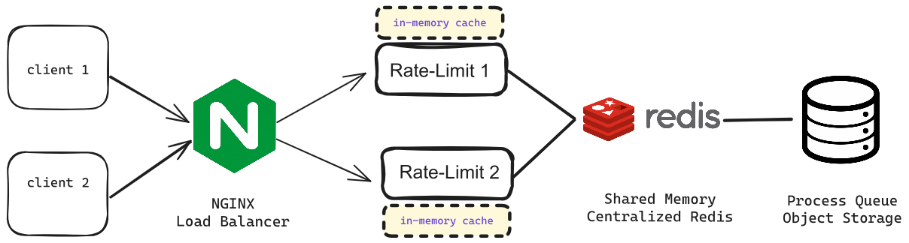

## ArvanCloud Interview

[](https://raw.githubusercontent.com/modarreszadeh/rate-limitter/main/LICENSE)


## System Architecture Diagram



## Overview

An `Nginx` web server is deployed at the endpoint gateway, responsible for load balancing between nodes as the master
node. This is achieved using a basic and conventional algorithm, such as `round-robin`. Nginx directs requests to
the `rate limiter` module, deployed as a `distributed` service.

The general structure of this module involves caching the rating rules of each user `in-memory` within its own node
before sending the data to `Redis` database
for synchronization. The decision to maintain each user's rating data in the cache inside the node, instead of directly
sending it to Redis, is aimed at reducing the latency of requests.

Redis Deployed as a `centralized` database and
`shared memory` for sync rating rule of each user between nodes.

Finally, the user's request, enters our processing queue, which employs the Worker Pool Concurrency Pattern and is
implemented as a `Concurrent Queue`. After dispatch, the processing in the queue leads to the storage of a fake object
in Storage.

## Distributed Locks

One of the problems of this architecture is the
`race condition` because we are doing an atomic operation on Redis, which means that more than one node of our rate
limit service may want to change the same data at the same time.
To solve this problem, we use both the lock mechanism in Golang with the help of `sync.Mutex` and the
`Lua Script` on the Redis side, that is, we put the lock on the Redis side.

## Run and Usage

install `docker` and `docker compose` in your machine

on Linux or Mac in root directory

```shell
make run
```

on Windows in root directory

```powershell
docker compose --file deploy/docker-compose.yml up --scale gateway=2
```

For test rate-limit functionality, run fallowing command:

```shell
curl --location 'http://127.0.0.1:4000/object-storage?userId=1' \
--header 'Content-Type: application/json' \
--data '{
    "objectId": "1cbs5",
    "sizeInByte": 1000000,
    "bucketName": "bucket-1",
    "fileName": "f1.png"
}'
```

Or for sequential requests running below script:

```shell
for i in {1..200}; do
  curl --location 'http://127.0.0.1:4000/object-storage?userId=1' \
--header 'Content-Type: application/json' \
--data '{
    "objectId": "1cbs5",
    "sizeInByte": 1000000,
    "bucketName": "bucket-1",
    "fileName": "f1.png"
}'
  sleep 0.1
done
```
